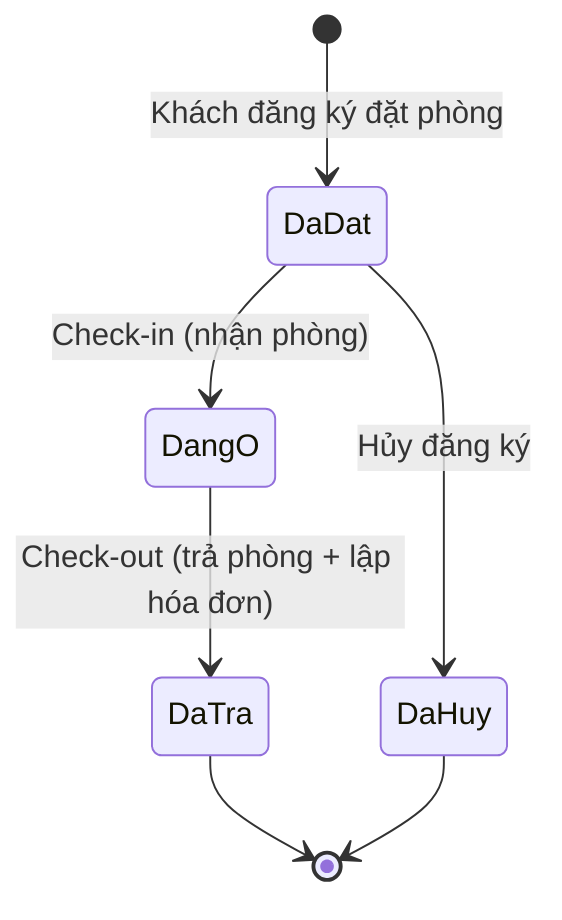

# 01 — Phân tích nghiệp vụ: Quản lý thuê phòng khách sạn (Đề 05)

> Vai trò trong nhóm: **Nguyễn Văn Tuấn** — phụ trách CSDL, kiến trúc chương trình, xử lý nghiệp vụ phức tạp, tích hợp hệ thống (theo `PhanCongNhiemVu.docx`).
> Tài liệu này là bước phân tích trước khi thiết kế CSDL — xem tiếp [02-ThietKe-CSDL.md](./02-ThietKe-CSDL.md).

## 1. Bối cảnh & mục tiêu

Xây dựng phần mềm desktop (WinForms, C#.NET) quản lý nghiệp vụ thuê phòng khách sạn: đặt phòng, nhận phòng, sử dụng dịch vụ, trả phòng và thanh toán. CSDL trên SQL Server, toàn bộ thao tác ghi dữ liệu (thêm/sửa/xóa) phải thông qua Stored Procedure. Báo cáo in bằng Crystal Report.

## 2. Tác nhân (Actors)

| Tác nhân | Mô tả |
|---|---|
| **Nhân viên lễ tân** | Người dùng chính của phần mềm: tiếp nhận đăng ký, làm thủ tục nhận/trả phòng, ghi nhận dịch vụ, lập hóa đơn. |
| **Khách hàng** | Liên hệ đặt phòng qua lễ tân (điện thoại/trực tiếp) — **không** đăng nhập trực tiếp vào hệ thống, chỉ là đối tượng dữ liệu được lễ tân nhập hộ. |
| **Quản lý (tùy chọn)** | Xem báo cáo doanh thu, quản trị danh mục (loại phòng, dịch vụ), có thể phân quyền cao hơn lễ tân nếu nhóm làm thêm chức năng đăng nhập. |

## 3. Danh sách chức năng (Functional Requirements)

| Mã | Chức năng | Ghi chú |
|---|---|---|
| FR1 | Quản lý khách hàng (thêm/sửa/xóa/tìm kiếm) | CMND/CCCD là khóa duy nhất |
| FR2 | Quản lý nhân viên | Mã NV, họ tên, chức vụ |
| FR3 | Quản lý loại phòng & phòng | Loại phòng quyết định sức chứa + đơn giá; phòng có trạng thái Trống/Đã đặt/Đang sử dụng/Bảo trì |
| FR4 | Quản lý danh mục dịch vụ | Tên dịch vụ, đơn giá, đơn vị tính |
| FR5 | Đăng ký đặt phòng | **Chỉ cho chọn phòng còn trống** trong khoảng ngày yêu cầu (ràng buộc bắt buộc theo đề bài) |
| FR6 | Nhận phòng (check-in) | Cập nhật ngày nhận thực tế, chuyển trạng thái phòng/đăng ký |
| FR7 | Ghi nhận sử dụng dịch vụ theo ngày | Mỗi dòng: đăng ký nào, dịch vụ gì, ngày nào, số lượng bao nhiêu |
| FR8 | Trả phòng (check-out) & lập hóa đơn | Tiền phòng (số đêm × đơn giá) + tổng tiền dịch vụ + chi phí phát sinh |
| FR9 | Ghi nhận chi phí phát sinh khác | Ví dụ: đền bù hỏng đồ, phí trả phòng muộn... |
| FR10 | In hóa đơn thanh toán | Crystal Report, gọi từ chương trình |
| FR11 | Báo cáo doanh thu (theo dịch vụ, theo phòng, theo khoảng thời gian) | Crystal Report |
| FR12 *(tùy chọn)* | Đăng nhập hệ thống, phân quyền Admin/Lễ tân | Cộng điểm, không bắt buộc theo đề bài |

## 4. Quy tắc nghiệp vụ quan trọng (Business Rules)

Đây là phần giám khảo sẽ soi kỹ nhất vì đề bài nhấn mạnh trực tiếp — cần bám sát khi viết Stored Procedure ở bước sau:

1. **Kiểm tra phòng trống khi đăng ký**: một phòng chỉ được đăng ký nếu không có đăng ký nào khác (đang ở trạng thái `DaDat` hoặc `DangO`) có khoảng ngày `[NgayNhan, NgayTra)` giao nhau với khoảng ngày khách mới yêu cầu. Công thức overlap chuẩn:
   `NOT (NgayTra_moi <= NgayNhan_cu OR NgayNhan_moi >= NgayTra_cu)`
2. **Vòng đời một đăng ký** (state machine): `DaDat → DangO → DaTra`, hoặc `DaDat → DaHuy`. Không cho phép nhảy ngược trạng thái.
3. **Đồng bộ trạng thái phòng theo đăng ký**: phòng `Trong` khi không có đăng ký active; chuyển `DaDat` khi có đăng ký ở tương lai; chuyển `DangSD` khi khách đã check-in; trở lại `Trong` khi trả phòng xong.
4. **Công thức thanh toán khi trả phòng**:
   `TongTien = TienPhong + TienDichVu + TienPhatSinh`
   - `TienPhong = SoNgayO × DonGia(loại phòng)`, với `SoNgayO = DATEDIFF(day, NgayNhanThucTe, NgayTraThucTe)` (tối thiểu 1 ngày).
   - `TienDichVu = SUM(SoLuong × DonGia)` trên tất cả dòng `tblHoadonchitiet` của đăng ký đó.
   - `TienPhatSinh = SUM(SoTien)` trên tất cả dòng chi phí phát sinh của đăng ký đó.
5. **Giá dịch vụ được "chốt" tại thời điểm sử dụng** (lưu snapshot đơn giá vào `tblHoadonchitiet.DonGia` thay vì luôn tham chiếu `tblDichvu.DonGia`) — tránh trường hợp đổi giá dịch vụ sau này làm sai lệch hóa đơn cũ.
6. Mỗi đăng ký chỉ có **đúng một hóa đơn** khi trả phòng (quan hệ 1–1 giữa `tblDangky` và `tblHoadon`).

## 5. Sơ đồ trạng thái Đăng ký / Phòng

| Trạng thái Đăng ký | Trạng thái Phòng tương ứng |
|---|---|
| `DaDat` (đã đặt, chưa tới ngày nhận) | `DaDat` |
| `DangO` (đang lưu trú) | `DangSD` |
| `DaTra` / `DaHuy` | `Trong` (nếu không còn đăng ký active nào khác) |

## 6. Bảng dữ liệu đề xuất

Theo đề bài, 6 bảng bắt buộc là `tblKhach, tblNhanvien, tblPhong, tblDangky, tblDichvu, tblHoadonchitiet`. Đề bài cho phép **thêm bảng/trường nếu cần thiết** — nhóm bổ sung 3 bảng sau để đáp ứng đầy đủ nghiệp vụ (đặc biệt là "chi phí phát sinh khác" và yêu cầu lưu hóa đơn để in Crystal Report):

| Bảng thêm | Lý do |
|---|---|
| `tblLoaiPhong` | Chuẩn hóa: "sức chứa" và "đơn giá" đề bài gắn với **loại phòng** (đơn/đôi), không phải từng phòng riêng lẻ → tách bảng tránh trùng lặp dữ liệu, dễ sửa giá hàng loạt. |
| `tblHoadon` | Đề bài yêu cầu in hóa đơn (Crystal Report) và tính tổng tiền khi trả phòng → cần một bảng **lưu lại** kết quả tính tiền (không chỉ tính tạm rồi bỏ), phục vụ tra cứu/báo cáo doanh thu sau này. |
| `tblChiphiphatsinh` | Đề bài nói rõ "...và các chi phí phát sinh khác" — đây là khoản phí không thuộc dịch vụ (VD: đền bù hỏng đồ, phạt trả muộn), cần bảng riêng vì số lượng loại phí không cố định. |
| `tblTaikhoan` *(tùy chọn, Phase 2)* | Phục vụ FR12 (đăng nhập/phân quyền) nếu nhóm còn thời gian sau khi hoàn thành yêu cầu bắt buộc. |

Chi tiết cột, kiểu dữ liệu, khóa chính/ngoại: xem [02-ThietKe-CSDL.md](./02-ThietKe-CSDL.md).
