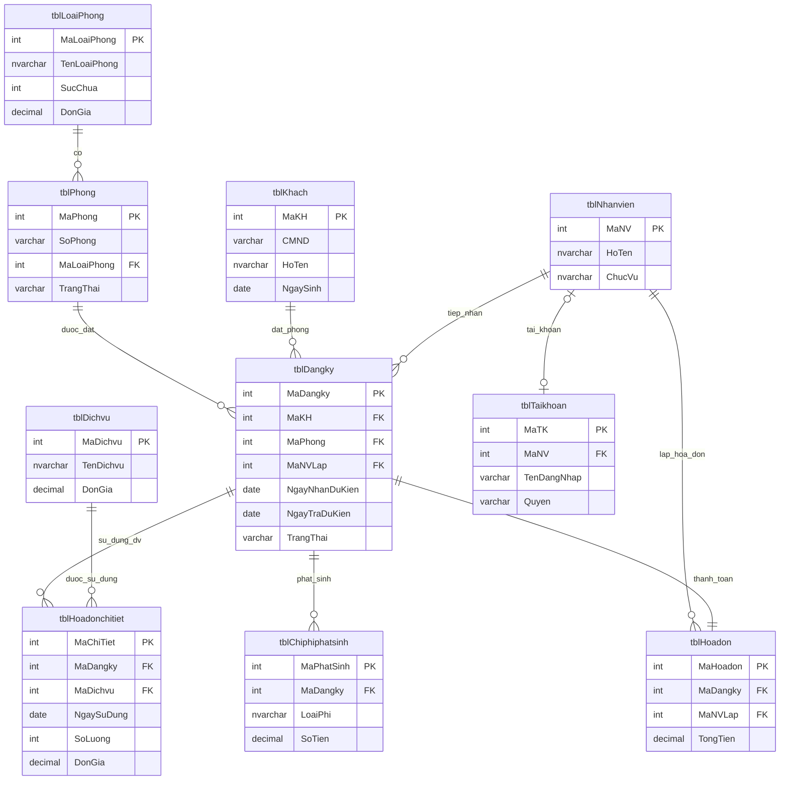

# 02 — Thiết kế CSDL: QLKhachSan (SQL Server)

> Script chạy được tương ứng: [`../sql/01_TaoDatabase_Bang.sql`](../sql/01_TaoDatabase_Bang.sql) (tạo DB + bảng + khóa + ràng buộc) và [`../sql/02_DuLieuMau.sql`](../sql/02_DuLieuMau.sql) (dữ liệu mẫu).
> Tên CSDL: `QLKhachSan` (khớp ví dụ connection string trong `HuongDanCaiDat.docx`).

## 1. Sơ đồ quan hệ thực thể (ERD)



## 2. Chi tiết từng bảng

### 2.1. `tblLoaiPhong` (bảng thêm)

| Trường | Kiểu | Ràng buộc | Mô tả |
|---|---|---|---|
| MaLoaiPhong | INT IDENTITY(1,1) | PK | Mã loại phòng |
| TenLoaiPhong | NVARCHAR(50) | NOT NULL, UNIQUE | Phòng Đơn / Phòng Đôi / Phòng VIP... |
| SucChua | INT | NOT NULL, CHECK > 0 | Số người tối đa |
| DonGia | DECIMAL(18,2) | NOT NULL, CHECK > 0 | Đơn giá / đêm |
| MoTa | NVARCHAR(255) | NULL | Mô tả thêm |

### 2.2. `tblPhong`

| Trường | Kiểu | Ràng buộc | Mô tả |
|---|---|---|---|
| MaPhong | INT IDENTITY(1,1) | PK | Mã phòng (surrogate key) |
| SoPhong | VARCHAR(10) | NOT NULL, UNIQUE | Số phòng hiển thị, VD "101" |
| MaLoaiPhong | INT | NOT NULL, FK → tblLoaiPhong | Loại phòng |
| Tang | INT | NULL | Tầng |
| TrangThai | VARCHAR(20) | NOT NULL, DEFAULT `'Trong'`, CHECK IN (`Trong,DaDat,DangSD,BaoTri`) | Trạng thái hiện tại |
| GhiChu | NVARCHAR(255) | NULL | |

### 2.3. `tblKhach`

| Trường | Kiểu | Ràng buộc | Mô tả |
|---|---|---|---|
| MaKH | INT IDENTITY(1,1) | PK | |
| CMND | VARCHAR(12) | NOT NULL, UNIQUE, CHECK chỉ chứa số | Số CMND/CCCD |
| HoTen | NVARCHAR(100) | NOT NULL | |
| NgaySinh | DATE | NOT NULL | |
| GioiTinh | BIT | NOT NULL, DEFAULT 1 | 1 = Nam, 0 = Nữ |
| SoDienThoai | VARCHAR(15) | NOT NULL, CHECK chỉ chứa số | |
| Email | VARCHAR(100) | NULL | |
| DiaChi | NVARCHAR(200) | NULL | |
| QuocTich | NVARCHAR(50) | NOT NULL, DEFAULT `N'Việt Nam'` | |
| NgayTao | DATETIME | NOT NULL, DEFAULT GETDATE() | Ngày tạo hồ sơ khách |
| GhiChu | NVARCHAR(255) | NULL | |

### 2.4. `tblNhanvien`

| Trường | Kiểu | Ràng buộc | Mô tả |
|---|---|---|---|
| MaNV | INT IDENTITY(1,1) | PK | |
| HoTen | NVARCHAR(100) | NOT NULL | |
| NgaySinh | DATE | NOT NULL | |
| GioiTinh | BIT | NOT NULL, DEFAULT 1 | |
| CMND | VARCHAR(12) | NOT NULL, UNIQUE | |
| SoDienThoai | VARCHAR(15) | NOT NULL | |
| DiaChi | NVARCHAR(200) | NULL | |
| ChucVu | NVARCHAR(50) | NOT NULL, DEFAULT `N'Lễ tân'` | |
| NgayVaoLam | DATE | NOT NULL, DEFAULT CAST(GETDATE() AS DATE) | |
| TrangThai | BIT | NOT NULL, DEFAULT 1 | 1 = đang làm việc, 0 = nghỉ việc |
| GhiChu | NVARCHAR(255) | NULL | |

### 2.5. `tblDichvu`

| Trường | Kiểu | Ràng buộc | Mô tả |
|---|---|---|---|
| MaDichvu | INT IDENTITY(1,1) | PK | |
| TenDichvu | NVARCHAR(100) | NOT NULL, UNIQUE | |
| DonGia | DECIMAL(18,2) | NOT NULL, CHECK > 0 | |
| DonViTinh | NVARCHAR(20) | NULL | lượt / suất / giờ... |
| TrangThai | BIT | NOT NULL, DEFAULT 1 | 1 = còn kinh doanh |
| GhiChu | NVARCHAR(255) | NULL | |

### 2.6. `tblDangky` (Đăng ký đặt phòng)

| Trường | Kiểu | Ràng buộc | Mô tả |
|---|---|---|---|
| MaDangky | INT IDENTITY(1,1) | PK | |
| MaKH | INT | NOT NULL, FK → tblKhach | Khách đặt phòng |
| MaPhong | INT | NOT NULL, FK → tblPhong | Phòng được đặt |
| MaNVLap | INT | NOT NULL, FK → tblNhanvien | Nhân viên nhận đăng ký |
| NgayDangKy | DATETIME | NOT NULL, DEFAULT GETDATE() | |
| NgayNhanDuKien | DATE | NOT NULL | |
| NgayTraDuKien | DATE | NOT NULL, CHECK > NgayNhanDuKien | |
| NgayNhanThucTe | DATETIME | NULL | Set khi check-in |
| NgayTraThucTe | DATETIME | NULL | Set khi check-out |
| SoKhach | INT | NOT NULL, DEFAULT 1, CHECK > 0 | |
| TrangThai | VARCHAR(20) | NOT NULL, DEFAULT `'DaDat'`, CHECK IN (`DaDat,DangO,DaTra,DaHuy`) | |
| GhiChu | NVARCHAR(255) | NULL | |

### 2.7. `tblHoadonchitiet` (Sử dụng dịch vụ theo ngày)

| Trường | Kiểu | Ràng buộc | Mô tả |
|---|---|---|---|
| MaChiTiet | INT IDENTITY(1,1) | PK | |
| MaDangky | INT | NOT NULL, FK → tblDangky (CASCADE DELETE) | |
| MaDichvu | INT | NOT NULL, FK → tblDichvu | |
| NgaySuDung | DATE | NOT NULL | |
| SoLuong | INT | NOT NULL, DEFAULT 1, CHECK > 0 | |
| DonGia | DECIMAL(18,2) | NOT NULL | **Snapshot** giá dịch vụ tại thời điểm dùng (không tham chiếu trực tiếp `tblDichvu.DonGia` để tránh hóa đơn cũ bị đổi khi giá dịch vụ thay đổi sau này) |
| ThanhTien | AS (`SoLuong * DonGia`) PERSISTED | Computed | |
| GhiChu | NVARCHAR(255) | NULL | |

### 2.8. `tblChiphiphatsinh` (bảng thêm)

| Trường | Kiểu | Ràng buộc | Mô tả |
|---|---|---|---|
| MaPhatSinh | INT IDENTITY(1,1) | PK | |
| MaDangky | INT | NOT NULL, FK → tblDangky (CASCADE DELETE) | |
| LoaiPhi | NVARCHAR(100) | NOT NULL | VD: "Đền bù hỏng đồ", "Phí trả phòng muộn" |
| SoTien | DECIMAL(18,2) | NOT NULL, CHECK >= 0 | |
| NgayPhatSinh | DATE | NOT NULL, DEFAULT CAST(GETDATE() AS DATE) | |
| GhiChu | NVARCHAR(255) | NULL | |

### 2.9. `tblHoadon` (bảng thêm — hóa đơn thanh toán khi trả phòng)

| Trường | Kiểu | Ràng buộc | Mô tả |
|---|---|---|---|
| MaHoadon | INT IDENTITY(1,1) | PK | |
| MaDangky | INT | NOT NULL, **UNIQUE**, FK → tblDangky (CASCADE DELETE) | Quan hệ 1–1 với đăng ký |
| MaNVLap | INT | NOT NULL, FK → tblNhanvien | Nhân viên lập hóa đơn (thu ngân lúc trả phòng) |
| NgayLapHoadon | DATETIME | NOT NULL, DEFAULT GETDATE() | |
| SoNgayO | INT | NOT NULL, CHECK > 0 | |
| TienPhong | DECIMAL(18,2) | NOT NULL | |
| TienDichVu | DECIMAL(18,2) | NOT NULL, DEFAULT 0 | |
| TienPhatSinh | DECIMAL(18,2) | NOT NULL, DEFAULT 0 | |
| TongTien | AS (`TienPhong+TienDichVu+TienPhatSinh`) PERSISTED | Computed | Nguồn cho Crystal Report hóa đơn |
| HinhThucThanhToan | VARCHAR(20) | NOT NULL, DEFAULT `'TienMat'`, CHECK IN (`TienMat,ChuyenKhoan,The`) | |
| TrangThaiThanhToan | BIT | NOT NULL, DEFAULT 0 | 0 = chưa thanh toán, 1 = đã thanh toán |
| GhiChu | NVARCHAR(255) | NULL | |

### 2.10. `tblTaikhoan` *(tùy chọn — Phase 2, FR12)*

| Trường | Kiểu | Ràng buộc | Mô tả |
|---|---|---|---|
| MaTK | INT IDENTITY(1,1) | PK | |
| TenDangNhap | VARCHAR(50) | NOT NULL, UNIQUE | |
| MatKhau | VARBINARY(32) | NOT NULL | Băm bằng `HASHBYTES('SHA2_256', ...)`, **không** lưu plain-text |
| MaNV | INT | NOT NULL, UNIQUE, FK → tblNhanvien (CASCADE DELETE) | 1 tài khoản / 1 nhân viên |
| Quyen | VARCHAR(20) | NOT NULL, DEFAULT `'LeTan'`, CHECK IN (`Admin,LeTan`) | |
| TrangThai | BIT | NOT NULL, DEFAULT 1 | |
| LanDangNhapCuoi | DATETIME | NULL | |

> Bảng này **không bắt buộc** theo đề bài. Chỉ làm nếu nhóm hoàn thành 3.1 + 3.2 sớm và còn thời gian trước 16/09.

## 3. Ràng buộc khóa ngoại & hành vi xóa (ON DELETE)

| FK | Hành vi | Lý do |
|---|---|---|
| tblPhong.MaLoaiPhong → tblLoaiPhong | NO ACTION | Không xóa loại phòng đang có phòng sử dụng |
| tblDangky.MaKH / MaPhong / MaNVLap → * | NO ACTION | Giữ lịch sử, không cho xóa khách/phòng/NV đã từng phát sinh đăng ký |
| tblHoadonchitiet.MaDangky → tblDangky | **CASCADE** | Xóa đăng ký (nếu được phép) thì xóa luôn chi tiết dịch vụ đi kèm |
| tblHoadonchitiet.MaDichvu → tblDichvu | NO ACTION | |
| tblChiphiphatsinh.MaDangky → tblDangky | **CASCADE** | |
| tblHoadon.MaDangky → tblDangky | **CASCADE** | Quan hệ 1–1, hóa đơn phụ thuộc vòng đời đăng ký |
| tblHoadon.MaNVLap → tblNhanvien | NO ACTION | |
| tblTaikhoan.MaNV → tblNhanvien | CASCADE | |

> Trong thực tế nghiệp vụ, ứng dụng **không cho phép xóa cứng** một đăng ký đã `DaTra` (chỉ xóa được đăng ký ở trạng thái `DaDat`/`DaHuy` chưa phát sinh gì) — ràng buộc CASCADE ở CSDL chỉ là lưới an toàn kỹ thuật, logic chặn xóa thực hiện ở tầng ứng dụng/Stored Procedure.

## 4. Index bổ sung (ngoài PK/UNIQUE tự động có index)

```sql
CREATE INDEX IX_Dangky_MaPhong ON tblDangky(MaPhong);
CREATE INDEX IX_Dangky_MaKH ON tblDangky(MaKH);
CREATE INDEX IX_Dangky_TrangThai ON tblDangky(TrangThai);
CREATE INDEX IX_Hoadonchitiet_MaDangky ON tblHoadonchitiet(MaDangky);
CREATE INDEX IX_Chiphiphatsinh_MaDangky ON tblChiphiphatsinh(MaDangky);
```

Lý do: các cột FK này sẽ liên tục được `WHERE`/`JOIN` khi tra cứu phòng trống, tính hóa đơn, lọc theo trạng thái — SQL Server không tự tạo index cho FK như PK.

## 5. Danh sách Stored Procedure dự kiến (thiết kế — sẽ viết T-SQL ở bước sau)

> Theo đề bài, **mọi thao tác thêm/sửa/xóa phải là Stored Procedure**. Danh sách dưới đây là bản thiết kế chữ ký (signature) để cả nhóm biết trước tên & tham số, tránh code trùng lặp. Phần thân (body) sẽ triển khai ở bước kế tiếp (chưa nằm trong phạm vi tài liệu này).

| Tên SP | Tham số chính | Mục đích | Người code module gọi |
|---|---|---|---|
| `sp_Khach_ThemSua` / `sp_Khach_Xoa` / `sp_Khach_TimKiem` | MaKH, CMND, HoTen... | CRUD khách hàng | Trần Quốc Trung |
| `sp_NhanVien_ThemSua` / `sp_NhanVien_Xoa` / `sp_NhanVien_TimKiem` | MaNV, HoTen... | CRUD nhân viên | Trần Anh Tú |
| `sp_LoaiPhong_ThemSua` / `sp_LoaiPhong_Xoa` | MaLoaiPhong, TenLoaiPhong, SucChua, DonGia | CRUD loại phòng | Đậu Phi Tuấn |
| `sp_Phong_ThemSua` / `sp_Phong_Xoa` / `sp_Phong_CapNhatTrangThai` | MaPhong, SoPhong, MaLoaiPhong, TrangThai | CRUD phòng + đổi trạng thái | Đậu Phi Tuấn |
| `sp_DichVu_ThemSua` / `sp_DichVu_Xoa` | MaDichvu, TenDichvu, DonGia | CRUD dịch vụ | Đậu Phi Tuấn |
| `sp_Phong_KiemTraTrong` | MaPhong, NgayNhan, NgayTra | Kiểm tra 1 phòng có trống trong khoảng ngày không (rule #1 mục Business Rules) | Nguyễn Văn Tuấn (dùng chung) |
| `sp_Phong_DanhSachTrong` | NgayNhan, NgayTra, MaLoaiPhong (optional) | Trả về danh sách phòng trống để hiển thị combobox khi đăng ký | Nguyễn Văn Tuấn |
| `sp_Dangky_Them` | MaKH, MaPhong, MaNVLap, NgayNhanDuKien, NgayTraDuKien, SoKhach | Tạo đăng ký mới — **bên trong gọi kiểm tra phòng trống trước khi insert** | Trần Quốc Trung gọi, Tuấn viết |
| `sp_Dangky_Sua` / `sp_Dangky_Huy` | MaDangky, ... | Sửa / hủy đăng ký (chỉ khi còn `DaDat`) | Trần Quốc Trung |
| `sp_Dangky_NhanPhong` | MaDangky, NgayNhanThucTe | Check-in: set NgayNhanThucTe, đổi TrangThai → DangO, đổi tblPhong.TrangThai → DangSD | Nguyễn Văn Tuấn |
| `sp_HoaDonChiTiet_ThemSua` / `_Xoa` | MaDangky, MaDichvu, NgaySuDung, SoLuong | Ghi/sửa/xóa dòng sử dụng dịch vụ (tự lấy DonGia hiện hành của dịch vụ để snapshot) | Đậu Phi Tuấn |
| `sp_ChiPhiPhatSinh_ThemSua` / `_Xoa` | MaDangky, LoaiPhi, SoTien | CRUD chi phí phát sinh | Trần Anh Tú |
| `sp_Dangky_TraPhong_LapHoaDon` | MaDangky, MaNVLap, NgayTraThucTe, HinhThucThanhToan | **Nghiệp vụ trọng tâm**: tính SoNgayO, TienPhong, TienDichVu, TienPhatSinh → insert `tblHoadon`, đổi TrangThai đăng ký → DaTra, đổi phòng → Trong | Nguyễn Văn Tuấn |
| `sp_BaoCao_DoanhThuDichVu` | TuNgay, DenNgay | Nguồn dữ liệu cho Crystal Report doanh thu | Nguyễn Văn Tuấn |
| `sp_TaiKhoan_DangNhap` ✅ đã làm | TenDangNhap, MatKhau | Kiểm tra đăng nhập (so khớp HASHBYTES) | — |
| `sp_TaiKhoan_DoiMatKhau` ✅ đã làm | MaTK, MatKhauCu, MatKhauMoi | Đổi mật khẩu, kiểm tra mật khẩu cũ trước khi đổi | — |

## 6. Dữ liệu mẫu

Xem script đầy đủ tại [`../sql/02_DuLieuMau.sql`](../sql/02_DuLieuMau.sql). Kịch bản dữ liệu mẫu bao phủ đủ 3 trạng thái vòng đời để test:

- **Đăng ký #1** (phòng VIP, KH Trần Văn Nam): đã `DaTra` — có đầy đủ chi tiết dịch vụ (ăn sáng, spa, giặt ủi), 1 khoản phát sinh, và 1 hóa đơn hoàn chỉnh → dùng để test tính tiền + in Crystal Report.
- **Đăng ký #2** (phòng đôi, KH Nguyễn Thị Hoa): đang `DangO` — có vài dòng dịch vụ nhưng **chưa** có hóa đơn → dùng để test màn hình "sử dụng dịch vụ" và luồng trả phòng.
- **Đăng ký #3** (phòng đôi, KH Đỗ Minh Khôi): mới `DaDat`, ngày nhận trong tương lai → dùng để test rule kiểm tra phòng trống (không được đặt trùng phòng 103 trong khoảng 10/09–12/09).

## 7. Việc cần làm tiếp theo (chưa nằm trong tài liệu này)

1. Chạy `01_TaoDatabase_Bang.sql` rồi `02_DuLieuMau.sql` trên SQL Server Express, kiểm tra bằng SSMS.
2. Cả nhóm góp ý thiết kế bảng (theo lịch GĐ2 trong `PhanCongNhiemVu.docx`, hạn 08/09).
3. Sau khi CSDL chốt, mới viết phần thân T-SQL cho các Stored Procedure ở mục 5.
4. Xem kế hoạch code ứng dụng C# WinForms tại [03-KeHoach-Code.md](./03-KeHoach-Code.md).
